# Movies Flix

This application uses AI and MongoDB for embeddings vector search using movies data.

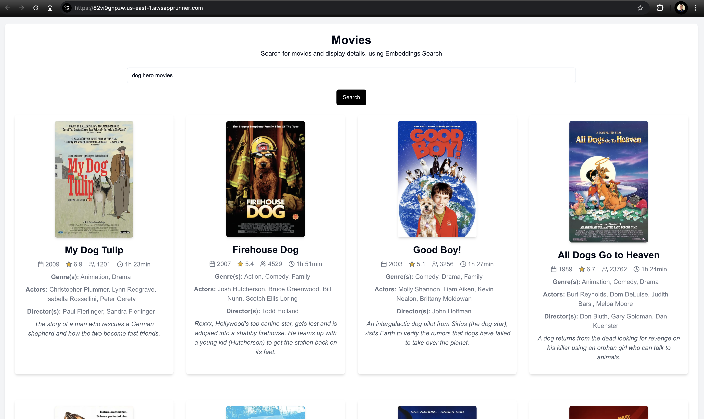

This application performs semantic searches, returning results that are contextually similar to the input query rather than relying solely on keyword matching.

The general workflow of vector search is illustrated in the diagrams below:

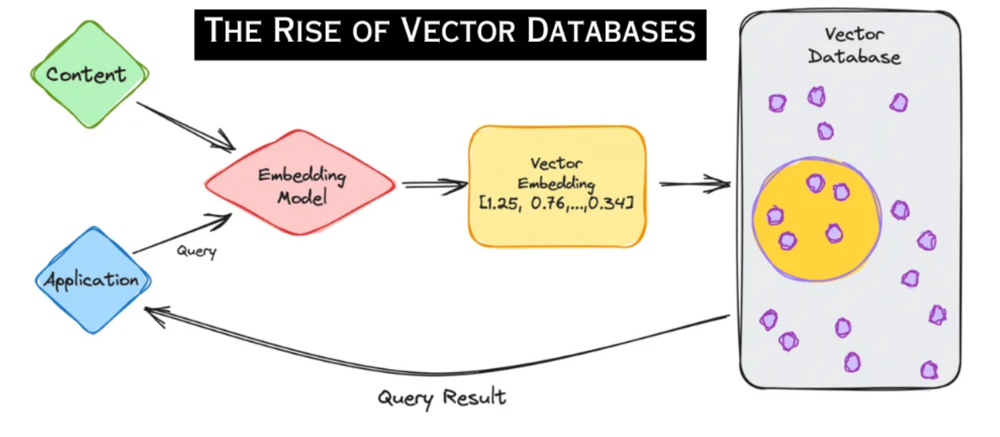

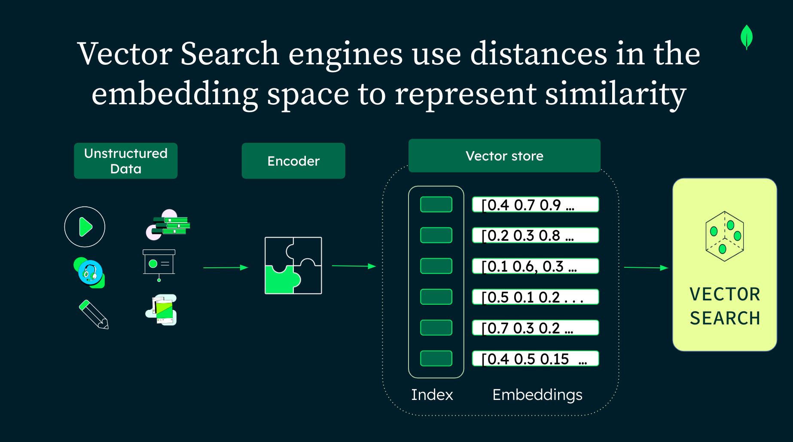

For more details, check out these resources:
1. [Article: What are Vector Databases? - by MongoDB](https://www.mongodb.com/resources/basics/databases/vector-databases)
2. [Slides: Using MongoDB Atlas Vector Search for AI semantic search - by Leonardo Gomes](https://docs.google.com/presentation/d/1dD7OFQCysE9c2B2NGd1ZMpWxBrNsfiBEcYLQJZ3RUDE/edit?usp=sharing)

## Technologies

- [JavaScript/TypeScript](https://www.typescriptlang.org/docs): JavaScript is a versatile programming language commonly used for web development. TypeScript is a superset of JavaScript that adds static types, enhancing code quality and maintainability.
- [React](https://react.dev): React is a JavaScript library created by Facebook. React is a User Interface (UI) library.
- [Next.js](https://nextjs.org/docs): A React framework that enables server-side rendering and static site generation, providing a powerful toolset for building modern web applications.
- [NestJS](https://docs.nestjs.com): A progressive Node.js framework for building efficient, reliable, and scalable server-side applications. It uses TypeScript and incorporates strong typing and modular architecture.
- [REST API](https://aws.amazon.com/what-is/restful-api): A REST API is an application programming interface (API) that follows the design principles of the REST architectural style.
- [OpenAI Embeddings API](https://platform.openai.com/docs/guides/embeddings): An API provided by OpenAI to generate embeddings, which are numerical representations of text used for various AI applications, including semantic search and natural language processing.
- [MongoDB Atlas](https://www.mongodb.com/docs/atlas/getting-started): MongoDB Atlas simplifies cloud data hosting and management.
- [MongoDB Atlas Vector Search](https://www.mongodb.com/docs/atlas/atlas-vector-search/vector-search-overview): Use Atlas Vector Search to query data in Atlas based on semantic meaning, not just keywords. This enhances AI-powered applications with semantic, hybrid, and generative search, including RAG.
- [MongoDB Driver for Node.js](https://mongodb.github.io/node-mongodb-native): The official MongoDB driver for Node.js, providing a native interface to interact with MongoDB databases from Node.js applications.
- [MongoDB Compass](https://www.mongodb.com/products/tools/compass): Compass is a free tool for querying, optimizing, and analyzing MongoDB data, offering insights and a drag-and-drop pipeline builder.

## Requirements

- Node.js version 23.6.1 or higher
- OpenAI account and token
- MongoDB Atlas account

## Setup Instructions

### OpenAI Account Setup
1. Sign up or log in to your account at [OpenAI](https://platform.openai.com).
2. Go to [API Keys](https://platform.openai.com/api-keys).
3. Use the "Create new secret key" button and copy the API key.

### MongoDB Cluster Setup

1. Go to [MongoDB Atlas](https://atlas.mongodb.com).
2. Create a new project (e.g., "Movies Flix") and use the "Create a Cluster" option:
  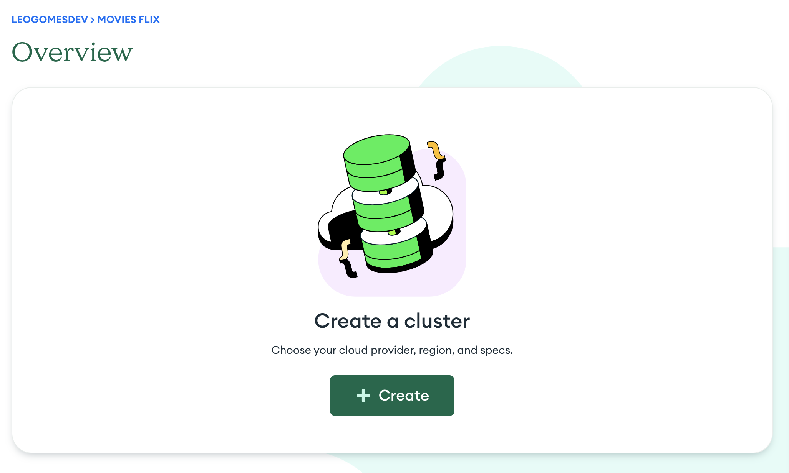
3. Select the Free tier (M0) and preload the sample dataset:
  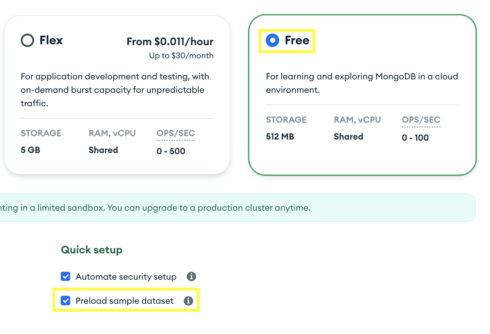
4. Use the "Create Deployment" button and wait for the cluster to be created.
5. Manage database access:
   1. Copy the database username and password.
   2. Navigate to SECURITY > Database Access to manage users.
   3. Navigate to SECURITY > Network Access to manage IP addresses (you may temporarily allow `0.0.0.0` for development).
6. Connect to your database using MongoDB Compass:
  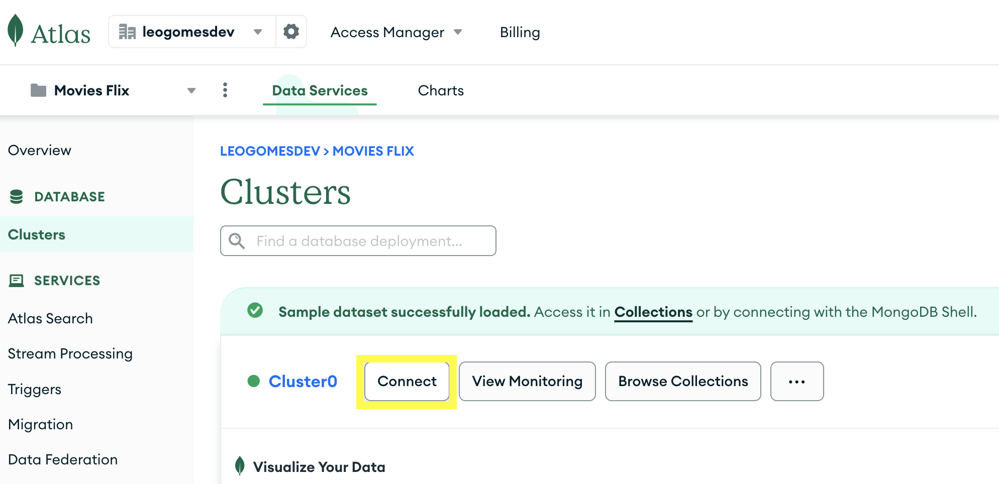
  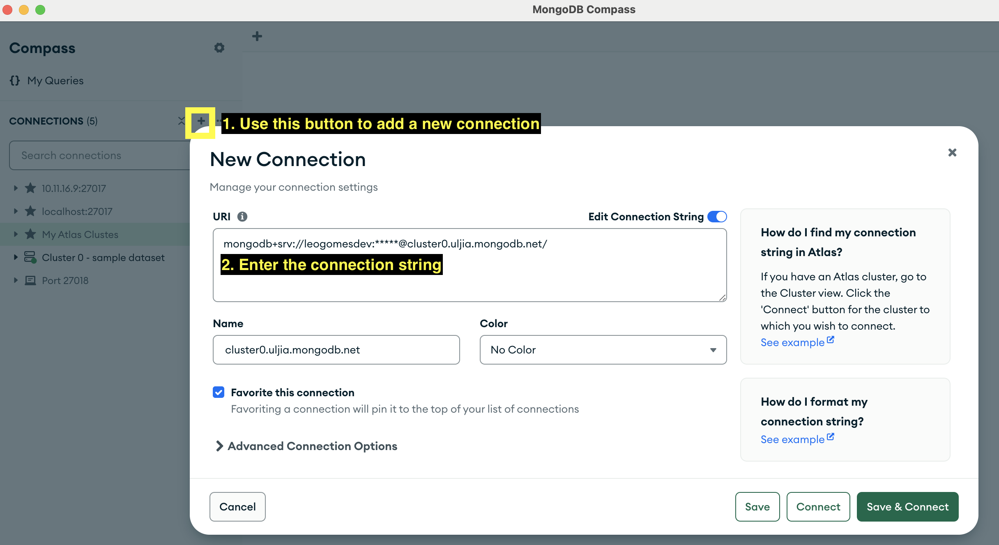
7. Navigate to the `sample_mflix.movies` collection, use the `Open MongoDB shell` button on the top-right, and run this command to clean up part of the data:
  ```js
  db["movies"].deleteMany({ $or: [{ "runtime": { $exists: false } }, { "genres": { $exists: false } }, { "plot": { $exists: false } }, { "directors": { $exists: false } }, { "poster": { $exists: false } }, { "cast": { $exists: false } }, { "languages": { $exists: false } }] })
  ```
8. Drop other `sample_*` databases in order to save storage space.
9. Refresh to check the number of documents:
  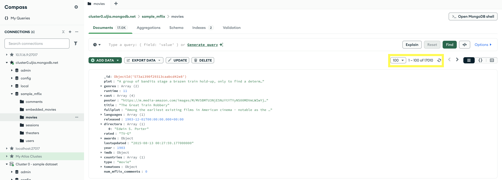

### MongoDB Atlas Vector Search Index Setup

1. In MongoDB Atlas, go to Atlas Search > Go to Atlas Search:
  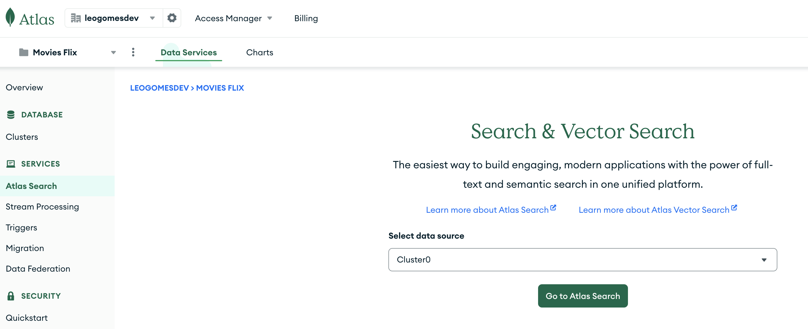
2. Click "Create Search Index" > Atlas Vector Search JSON Editor > Next:
  1. Database and Collection: Select `sample_mflix > movies`
  2. Index Name: `vectorsearch`
  3. Use the following JSON definition and click "Next" > "Create Vector Search Index":
      ````js
      {
        "fields": [
        {
          "numDimensions": 1536,
          "path": "embeddings",
          "similarity": "cosine",
          "type": "vector"
        }
        ]
      }
      ````

## Running the Application

### Backend

1. Run `cd server && cp -v .env.example .env`
2. Update the environment variables in the `.env` file.
3. If using [nvm](https://github.com/nvm-sh/nvm), run: `nvm use`
4. Run `npm install`
5. Run `npm run start:dev`

### Frontend

1. Run `cd client && cp -v .env.example .env`
2. Update the environment variables in the `.env` file.
3. If using [nvm](https://github.com/nvm-sh/nvm), run: `nvm use`
4. Run `npm install`
5. Run `npm run dev`

### Creating Embeddings

To add embeddings data to the `sample_mflix.movies` collection, run:
```bash
curl -X POST http://localhost:3001/movies/createEmbeddings -H "Content-Type: application/json" -d '{}'
```
This command uses the OpenAI embeddings API to populate the `embeddings` field for each movie. The embedding data input includes:
- Type
- Title
- Plot
- Genres
- Cast
- Directors
- Languages
- Runtime
- IMDb (rating and votes)

After running this command, check the new `embeddings` field using MongoDB Compass:
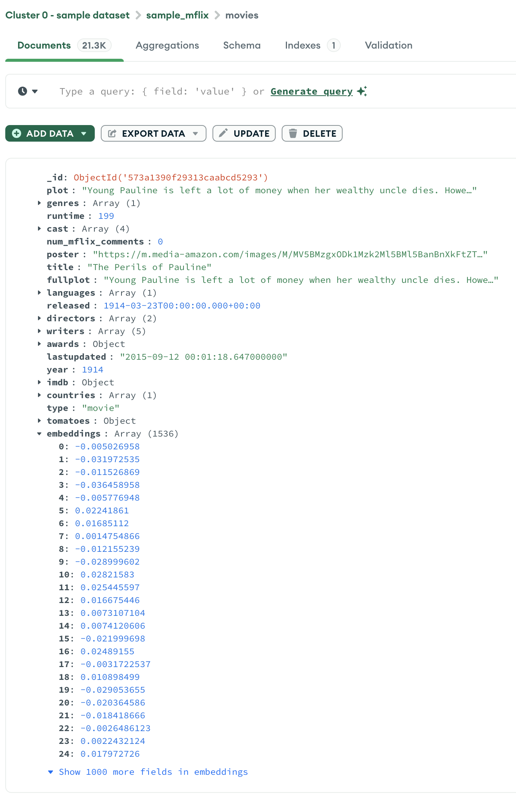

Check the status of your Atlas Search index:
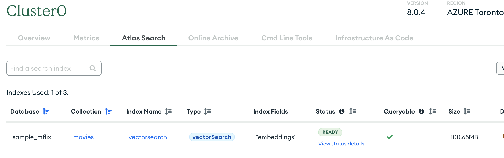

## Using the Application

1. Go to [http://localhost:3000](http://localhost:3000):
  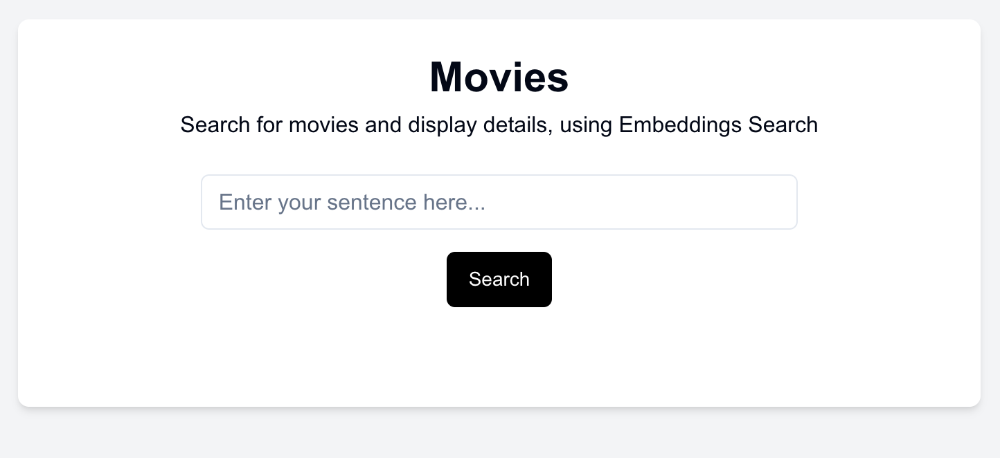
2. Enter a search query and hit the "Search" button. For example, searching for `dog hero movies` returns movies with descriptions containing `golden retriever`, `puppies`, etc., due to vector similarity:
  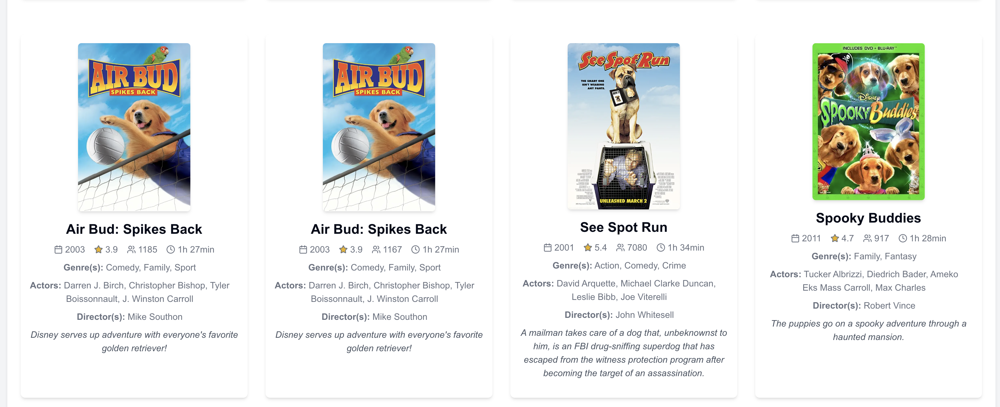


## How does it work?

1. **Input Query**: The user inputs a search query, such as "dog hero movies".
2. **Generate Embeddings**: The application uses the OpenAI Embeddings API to convert the input query into a vector representation.
    1. **API Request**:
      ````json
        {
          "input": "dog hero movies",
          "model": "text-embedding-ada-002"
        }
      ````
    2. **API Response**:
      ````json
      {
        "object": "list",
        "data": [
          {
            "object": "embedding",
            "index": 0,
            "embedding": [ /* vector data */]
          }
        ],
        "model": "text-embedding-ada-002",
        "usage": {
          "prompt_tokens": 3,
          "total_tokens": 3
        }
      }
      ````
3. **Vector Search**: The generated vector is used to query the MongoDB Atlas Vector Search index.
    1. **MongoDB Query**:
      ```json
      [
        {
          "$vectorSearch": {
            "queryVector": [/* vector data */],
            "path": "embeddings",
            "numCandidates": 100,
            "index": "vectorsearch",
            "limit": 100
          }
        }
      ]
      ```
4. **Retrieve Results**: MongoDB returns the most relevant documents based on vector similarity, which are then displayed to the user.
